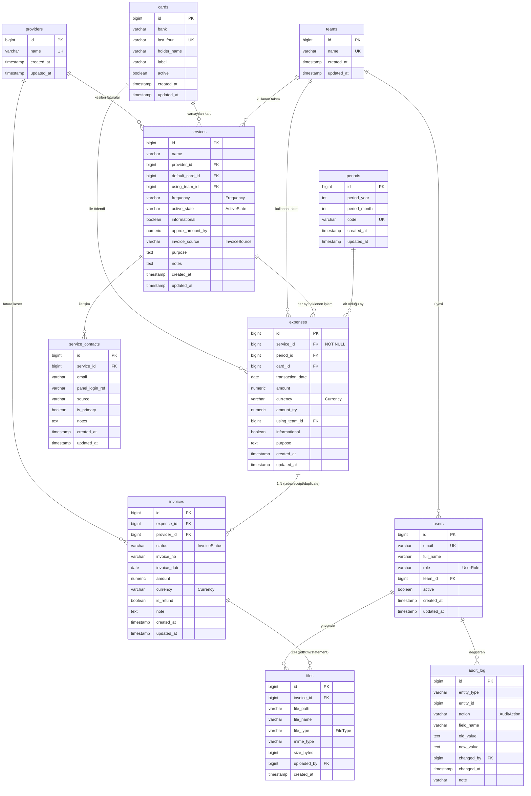

# account-hr — ER Diyagramı (SERVICE-FIRST)

Tüm 11 tablo ve ilişkileri. Çekirdek varlık **services** (master liste); eksik fatura
tespiti `services` → `expenses` → `invoices` → `files` zinciri üzerinden yapılır.

## İlişki Özeti
- `service → provider` N:1, `service → default_card` N:1 (nullable), `service → using_team` N:1 (nullable)
- `service_contact → service` N:1
- `expense → service` N:1 (**zorunlu** FK — eşleşme anahtarı), `expense → period` N:1, `expense → card` N:1 (nullable), `expense → using_team` N:1 (nullable)
- `invoice → expense` N:1 (**expense → invoices = 1:N**), `invoice → provider` N:1 (nullable)
- `file → invoice` N:1 (**invoice → files = 1:N**), `file → uploaded_by(user)` N:1 (nullable)
- `user → team` N:1 (nullable)
- `audit_log → user` (changed_by) N:1 (nullable); entity_type + entity_id polimorfik referans
